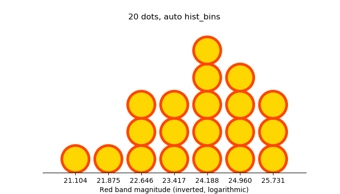
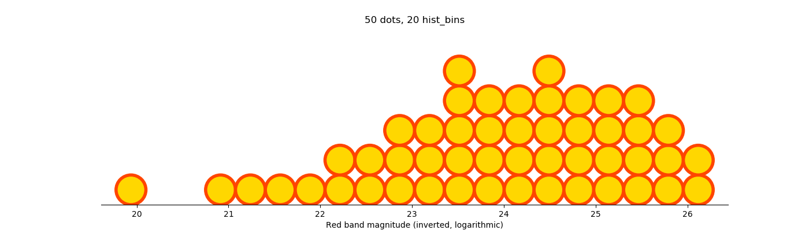
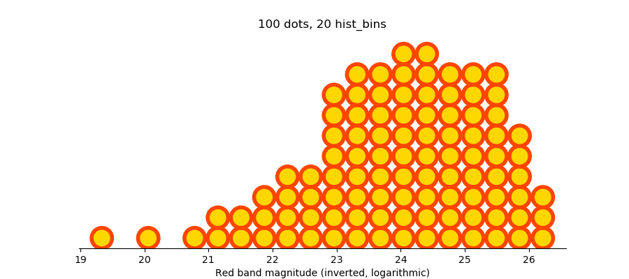

# Quantile Dotplot

Implementation of a *quantile dotplot* in Python. Credit to Kay, Kola, Hullman, and Munson for providing [papers](http://dx.doi.org/10.1145/2858036.2858558),  [implementations](https://github.com/mjskay/when-ish-is-my-bus/blob/master/quantile-dotplots.md), and [pleasant talks](https://www.youtube.com/watch?v=E1kSnWvqCw0) on the subject.

These plots turn continuous distributions into discrete events, turning percentile calculations into counting. For example, with this chart, we can quickly tell that 10% of the time, the bus will be here in less than 8 minutes, and 30% of the time, in less than 10.


The above plot is made with the code

```python
fig, ax = plt.subplots(figsize=(10, 4))
data = np.random.lognormal(mean=np.log(11.4), sigma=0.2, size=1_000_000)

ax = ntile_dotplot(data, dots=20, edgecolor="k", linewidth=2, ax=ax)

ax.set_xlabel("Minutes to bus")
for spine in ("left", "right", "top"):
    ax.spines[spine].set_visible(False)
ax.yaxis.set_visible(False)
```

where the `ntile_dotplot` command is provided by this library.

## Installation

```bash

pip install git+https://github.com/ColCarroll/quantile_dotplot
```

Requires `matplotlib` for plotting and `numpy` for histogram work.

## Quickstart

The library does its darndest to have [osculating dots](https://en.wikipedia.org/wiki/Osculating_circle) with reasonable aspect ratios, but errs on the side of osculating.

Here are three plots using [the CASt dataset](https://astrostatistics.psu.edu/datasets/COMBO17.html) from [Wolf et. al. (2004)](https://arxiv.org/abs/astro-ph/0403666). This plots the brightness of 3,462 galaxies using an inverse logarithmic scale, so a galaxy with a value of 21 is 100 times brighter than one with a 26.

This first plot is made with

```python
ntile_dotplot(data, dots=20, facecolor="gold", edgecolor="orangered", linewidth=4)
```



If we wish for more granularity, we can use

```python
ntile_dotplot(data, dots=50, hist_bins=20, facecolor="gold", edgecolor="orangered", linewidth=4)
```



Once you are using lots and lots of dots, maybe turning integration into counting is a hard task, and you should think about using fewer dots (each dot here corresponds to 1% of the data!)

```python
ntile_dotplot(data, dots=100, hist_bins=20, facecolor="gold", edgecolor="orangered", linewidth=4)
```



### References:

Matthew Kay, Tara Kola, Jessica Hullman, Sean Munson. *When (ish) is My Bus? User-centered Visualizations of Uncertainty in Everyday, Mobile Predictive Systems.* CHI 2016. DOI: [10.1145/2858036.2858558](http://dx.doi.org/10.1145/2858036.2858558).
